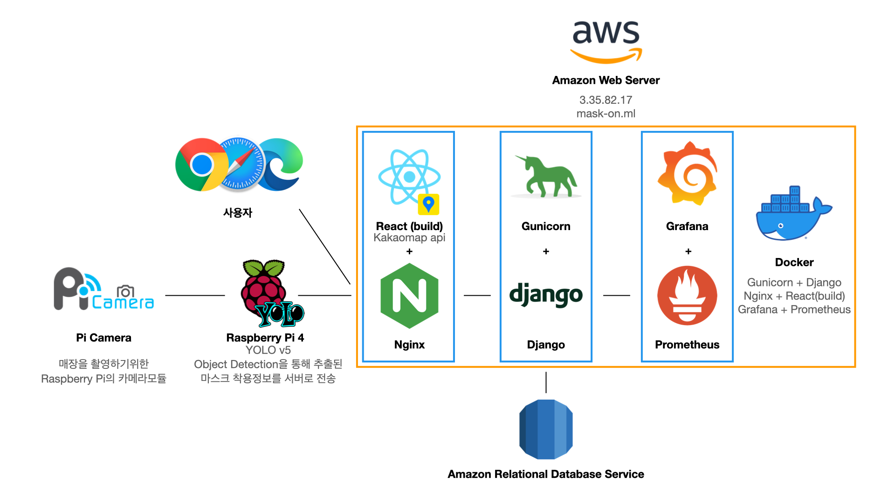
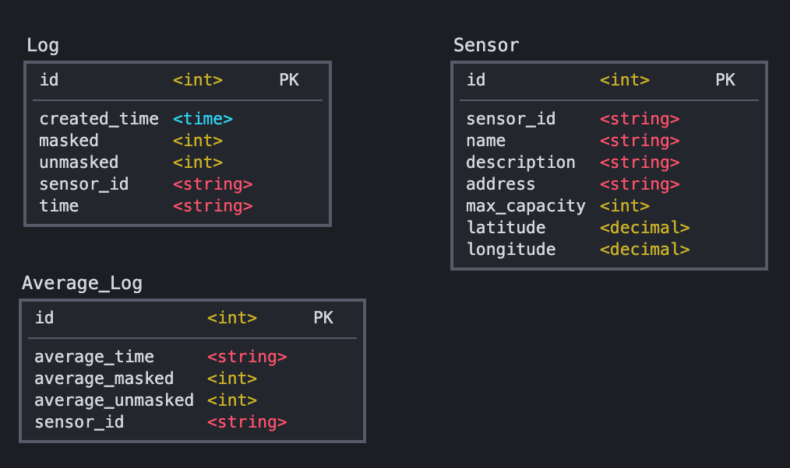

# Mask On

## Project-Period

2021.01.04 ~ 2021.02.05(5 Weeks)

## **Rationale**

코로나19 감염 사례를 보았을 때 이는 실내에서 마스크 미착용으로 전파되는 경우가 많다.

하지만 시민 입장에서 실시간으로 실내의 인원 현황, 마스크 착용률 등을 인지할 수 있는 방법이 없다.

`지금 A카페를 가도 괜찮을까? 지금 B식당을 가도 괜찮을까?`

해당 공간에 대한 실시간 정보를 제공한다면 시민 개개인의 의사결정을 도울 수 있을 것이라는 가정하에 이 프로젝트를 진행하게 되었다.

이 프로젝트는 실시간으로 실내 공간의 인원 및 마스크 착용 현황을 공유하는 코로나맵과 같은 서비스를 개발함으로써 이런 문제점을 해결하고자 한다.

각 매장에 라즈베리파이 기반 카메라를 설치한다는 가정으로 전체적인 프로세스는 아래와 같다.

1. 라즈베리파이에서 매장의 사람을 인식한다.
2. 총 사람 수, 마스크 착용자 수, 미착용자 수에 대한 정보를 특정 시간 간격으로 웹서버로 송신한다.
3. 웹서버는 이를 수신하여 데이터베이스에 저장한다.
4. 지도를 기반으로 각 매장별 정보를 출력한다.

해당 데이터가 투명하게 공개된다면 시민들이 오프라인 공간을 방문할 때의 의사결정을 도울 수 있을 것이다.

또한 현재 업종별 명확하지 않은 영업 제한으로 인해 [피해받는 자영업자](https://www.donga.com/news/Economy/article/all/20201217/104481979/1)들이 많은데 이를 통해 현실적인 영업 제한의 근거로 사용될 수 있을 것으로 기대된다.

## Demo


## Architecture



## Requirements

- Deploy
    - Docker: 19.03.x
    - Docker-compose: 1.26.x

- Raspberrypi & Yolo
    - OS: [Raspberrypi 64 bit buster](https://www.raspberrypi.org/forums/viewtopic.php?t=275370)
    - Python: 3.7
    - Opencv: 4.5.0
    - Torch: 1.7
    - Torchvison: 0.8

    보다 디테일한 환경 설정은 [rpi README](https://github.com/Team-Mask-On/Mask_On/tree/master/rpi)에서 확인 가능

## Installation

```json
# back/django/secrets.json
{
    "SECRET_KEY": "Your Django Secret Key",
    "DB_USER": "Your Database Username",
    "DB_PASSWORD": "Your Database Password",
    "DB_HOST": "Your Database Host"
}
```

```bash
# Web Server
> docker-compose build
> docker-compose up -d

# React build
> cd front/kakao
> docker build -t front-img .
# React build하기 인자에 관해서는 front의 Readme.md 참조
> docker run -it -v $(pwd):/app -e REACT_APP_KAKAO_APP_KEY=xxxxxxxxxxxxxxxxxxxxxxxxxxxxxxx -e REACT_APP_API_URL=http://example:8000 -e REACT_APP_REFRESH_TERM=50000 front-img bash
$ npm run build

# Raspberry pi & AI
> cd rpi
> python3 main.py
촬영 간격을 입력하시오: "원하는 촬영 간격 입력(s)"
# 입력하는 수에 따라 실제 이미지를 캡처하는 간격 및 시간대 끊어서 저장되는 것 구현됨
# (ex) 300 -> 5분 간격 촬영, 시간: 0905, 0910, ...으로 끊어서 저장
```

## **Detailed Info**
 | Name   | Port         | Description | 
| ------ | ------------ | ---- | 
| Nginx | 80 | 가벼움과 높은 성능을 목표로 하는  웹서버로 서버로서의 역할과 프록시로서의 역할을 수행한다.  | 
| [React (on Nginx)](https://github.com/Team-Mask-On/Mask_On/tree/master/front) | 80 | 서버로부터 각 센서정보를 받아와 Kakao map상에 표시하고, 선택된 센서의 마스크 착용 현황, 평균, 로그 등을 확인할 수 있도록 보여주는 역할을 합니다.      | 
| [Django + Gunicorn](https://github.com/Team-Mask-On/Mask_On/tree/master/back) | 8000 |  Mask-On의 서버. 모든 행동의 중심에 위치하여 웹서버, Raspberry pi, DB 간의 소통을 담당한다.  | 
| Amazon RDS | 3306 | Database    | 
| [Grafana](https://github.com/Team-Mask-On/Mask_On/tree/master/back#1-grafana) | 3000 | cAdvisor, Prometheus, NodeExporter를 통해 전달받은 시간별 매트릭 데이터를 시각화하여 대시보드로 제공해줍니다.    |
| [cAdvisor](https://github.com/Team-Mask-On/Mask_On/tree/master/back#4-cadvisor) | 8080 | 사용중인 도커 컨테이너의 리소스 사용량을 측정하여 시계열 매트릭 데이터화합니다. |
| [Prometheus](https://github.com/Team-Mask-On/Mask_On/tree/master/back#3-prometheus) | 9090 | cAdvisor, node exporter의 시계열 매트릭 데이터를 수집하여 시스템 모니터링 및 경고합니다. |
| [Alert Manager](https://github.com/Team-Mask-On/Mask_On/tree/master/back#6-alertmanager) | 9093 | Prometheus로부터 alert를 전달받아 이를 적절한 포맷으로 가공하여 슬랙, 이메일로 notify 해주는 역할을 합니다. |
| [Node Exporter](https://github.com/Team-Mask-On/Mask_On/tree/master/back#5-node-exporter) | 9100 | 서버의 cpu, 메모리, 디스크, 네트워크 사용량등 호스트 관련 매트릭 데이터를 수집하여 api로 노출시킵니다.   |
| [Raspberry Pi](https://github.com/Team-Mask-On/Mask_On/tree/master/rpi) | - | ai 디렉토리의 yolov5 모델을 활용하여 매장 내 마스크 착용자와 미착용자를 분석하고 서버로 송신하는 역할을 합니다.  보다 세부적인 설명은 rpi/readme에서 확인 가능합니다.  |

## **Members**

| 이름   | 학과         | 역할 | 소개 페이지                                         |
| ------ | ------------ | ---- | --------------------------------------------------- |
| 임준규 | 컴퓨터공학과 | AI, Deep Learning     | [개인 프로필로 이동](https://github.com/Limm-jk) |
| 양승훈 | 컴퓨터공학과 | Frontend     |  [개인 프로필로 이동](https://github.com/Yabby1997)   |
| 오현택 | 모바일시스템공학과 | Backend     | [개인 프로필로 이동](https://github.com/HyunTaek5)   |
| 한승욱 | 컴퓨터공학과   |  Raspberry pi    | [개인 프로필로 이동](https://github.com/SeungWookHan)                                                    |

## **Tech-Stack**
|분류|기술|
|------|---|
|배포환경|AWS EC2 Ubuntu 20.04 LTS|
|개발환경|Docker, Docker-compose|
|학습환경|Google Colab|
|AI|YOLO v5, PyTorch|
|Front-end|HTML5, CSS3, JavaScript, React.js|
|Back-end|Nginx, Django, Grafana, Prometheus|
|Raspberrypi|Raspberry Pi 4, pi camera|
|DB|AWS RDS MySQL|
|api|Kakaomaps API|

## Database Modeling



- Sensor: 한개의 매장에 종속되는 라즈베리파이 하드웨어 테이블.
    - sensor 고유번호, 매장 이름, 설명, 주소, 최대 수용인원, 위도, 경도
- Log: Sensor에서 특정 시간 간격으로 분석한 매장정보에 대한 로그
    - log 생성시간, 마스크 착용 인원, 마스크 미착용 인원, 귀속되는 sensor, 시간(0900, 0905, ...)
- Average_Log: Log가 들어올때마다 자동 생성되는 시간대별 평균 데이터
    - 시간(0900, 0905, ...), 평균 마스크 착용 인원, 평균 마스크 미착용 인원, sensor
    - 기존 로그에서 (시간대, sensor_id)별로 한데 묶어 average_table에 저장한다.
    - 한 sensor당 180개의 row가 필요함(0600 ~ 2100, 5분 단위)
    - 전국 700,000개의 음식점 가정하에 최대 126,000,000 개의 row가 요구됨

```json
1. sensor 모델은 관리자가 직접 추가하거나 seeder로 넣는다.
2. log 모델은 라즈베리파이가 송신하거나 seeder로 넣는다.
3. log를 수신했을 시에 해당 sensor id가 sensor 모델에 등록되어 있는지 확인한다.
4. 이때 시간은 라즈베리파이에서 송신할때 현시간을 기반으로 5분단위로 잘라서 string형식으로 송신한다. 
    (0900, 0905, ...)
5. 3번에서 유효성 확인이 되면 Log 모델에 create한다.
6. log가 수신될때마다 Average_Log는 자동으로 업데이트 된다.
```

## **Interface/API Definitions**
- [**API 문서(Postman)**](https://documenter.getpostman.com/view/14071038/TW71kRhG)  

| API   | Method         | Do | 
| ------ | ------------ | ---- | 
| api/sensors/ | GET | 모든 (혹은 근처의) Sensor 정보     | 
| api/logs/average/<int:sensor_id> | GET | 평균 masked/unmasked 정보     | 
| api/logs/<int:sensor_id> | GET | Sensor의 로그 정보     | 
| api/sensors/log-data/ | POST | 라즈베리파이에서 분석된 데이터 송신    | 

## **Git Convention**

### **Process**
- master: 본 서버 배포 / dev: 테스트 배포
- dev 브랜치에서 각자 브랜치를 따서 작업한다.
- 본인의 작업이 완료되면 브랜치를 push한다.
- dev 브랜치로 Pull Request를 작성한다.
- 주기적으로 dev 브랜치를 테스트하여 master에 합친다.
```
git branch feat/back/add-login-api
git checkout feat/back/add-login-api
git pull origin master --rebase
- 본인의 작업 실시 -
- 완료 되었을 경우-
git add *
git commit -m "[feat/back] add-login-api - #2"
git push origin feat/back/add-login-api
- 이후 깃헙에 들어가서 PR 작성 및 리뷰 리퀘스트 -
```
- 리뷰어의 Code Review를 받고 Pull Request를 Merge한다.
- **아래 상세 규칙 참조**

### **Branch**
### {타입}/{역할}/{내용}
- 브랜치명의 경우에는 **타입**, **역할**, **내용**으로 구성한다.
- **타입**, **역할**은 아래 Commit Message에서 설명하는 형식을 활용한다.
- **내용**의 경우에는 **-**으로 구분하며 개조식으로 작성한다.
- 각각 **/** 로 구분한다.
- 만약 **역할**을 명시하기 애매하다면 생략 가능하다.
- PR 간에  `Create a merge commit` 옵션을 이용하여 Merge
- ex) feat/front/add-react-app
- ex) feat/back/add-login-api
- ex) docs/add-readme

### **Commit Message**
1. 먼저 커밋 메시지는 크게 **제목, 본문** 두 가지 파트로 나누고, 각 파트는 빈줄을 두어서 구분합니다.
2. 커밋 메세지는 모두 **한글**로 통일합니다.
3. 제목의 경우 **타입, 역할**은 **대괄호 안에 소문자로 작성**합니다.
4. **타입** 다음에는 **/ 로 분리**하여 **역할을 명시**한다.
5. **내용** 작성후 우측에 **#이슈번호**를 남겨서 어떤 이슈에 대한 작업인지 명시합니다.
6. ex) #> git commit -m "[fix/front] XSS Vulnerability - #20"
```
[type/{front or back or AI or RPI}] Subject - #2 // -> 제목 

(한 줄을 띄워 분리합니다.)

body //  -> 본문 
```
#### 타입
- 어떤 의도인지 타입에 명세한다.
- [] 안에 타입을 명시한다.
- [] 다음에는 내용을 작성한다.
- 내용은 최대 50글자가 넘지 않도록 하고 마침표는 찍지 않는다.
1. `feat`: 새로운 기능 추가
```
ex)
[feat] 버튼 클릭 시 날짜 선택 하는 기능 추가

body: 버튼 클릭 시 picker를 통해 날짜를 선택하게 구현
picker뷰는 toolbar를 이용했음
```
2. `fix`: 버그 수정
```
ex)
[fix] 라벨 길이가 짤리는 버그 수정

body: 라벨 길이를 view leading에서 간격 추가
```
3. `refactor`: 코드 리팩토링
```
ex)
[refactor] MainVC 코드 정리

body: convension 내용 중 변수명을 지키지 못한 점 수정
lowerCamelCase를 지켜서 변수명을 수정했음
```
4. `style` : 색상 변경, 폰트 변경 등이 있는 경우
```
ex)
[style] back 버튼 색상 red로 변경

body: 제플린 수정으로 인해 black -> red로 변경
```

5. `upload` : 파일 생성하는 경우
```
ex)
[upload] HomeVC 파일 생성
```
6. `docs`: 문서 수정하는 경우
```
ex)
[docs] README.md 파일 수정

body: Git Message Convention 방법 정리
```

#### 역할
- ai: 인공지능, 딥러닝 관련 작업
- front: 프론트엔드 관련 작업
- back: 백엔드 관련 작업
- rpi: 라즈베리파이 관련 작업
- deploy : 배포 관련 작업

#### body
- **"body: " 를 앞에 포함**하여 작성합니다.
- 긴 설명이 필요한 경우에 작성합니다.
- **어떻게** 했는지가 아니라, **무엇을** **왜** 했는지를 작성합니다.

### Issue, PR
#### Issue
- 제목은 ex)`[back] 기능 명세`
- Issue Template - Feature

```markdown
## Feature 내용 
- [] ex. 컬렉션 뷰 레이아웃 잡기
- []
- [] 

```
- Issue Template - Bug

```markdown
## 어떤 bug 인가요? 

## 에러 메시지 또는 스크린샷

## bug 확인 방법
1. bug 위치 
2. 어떻게 발생하는지 (컴파일 에러, 등 )

## tried out solution 

```
#### PR
- PR Template
```markdown
## 작업 내용 
[ ]
[ ] 
[ ] 

## 관계된 이슈, PR : 

```

## **Communication Tool**

##### Slack(슬랙)
- **stand-up**: 매일 Dixi app을 통해 자신이 무엇을 했고, 무엇을 할 예정이고, 어떠한 문제점이 있는지 간단하게 공유하기 위한 채널
- **Notion App**: Notion에 변경사항이 발생하면 내용을 Slack의 지정채널로 보내주는 App

##### Notion

- **Design Docs** : 프로젝트의 흐름을 나타내는 Docs문서들을 저장 및 관리
- **회의록** : 회의나 업무 분배 등을 각각 기록

##### Google Drive(구글드라이브)

- word, excel, ppt 등의 산출물은 전부 구글드라이브에 저장
- **Google Docs**: 문서 자료는 최대한 드라이브 내에서 구글독스로 생성 및 작성
- **Google SpreadSheet**: 엑셀 자료는 최대한 드라이브 내에서 구글스프레드시트로 생성 및 작성
- **Google Presentation**: 시각화 자료는 최대한 드라이브 내에서 구글프레젠테이션으로 생성 및 작성
- **Google Form**: 설문조사가 필요할 시 해당 폼은 최대한 드라이브 내에서 구글폼으로 생성 및 작성

##### Discord

- 온라인 회의, 정규 업무를 진행할때 켜놓고 사용

##### Zoom(줌)

- 온라인 세션(팀원들끼리 지식 공유, 자신의 업무 실시간 공유 등)을 진행할 때 사용

##### Github(깃허브)

- Git으로 코드 버전 관리를 저장하기 위함
- Feature Branch 방식을 지향
- Projects의 칸반 템플릿을 사용하고 이 중 To Do, Doing, Done 리스트를 중점으로 사용
    - **To Do**: 자신이 해야하거나 할 예정의 업무들을 카드로 제작 - 업무명, 업무 종류, 중요도, 참여자 필수
    - **Doing**: To Do에서 업무를 시작한 카드는 Doing으로 옮김, 특이사항 발생시 카드에 표시
    - **Done**: 완료한 모든 업무는 Done으로 옮김