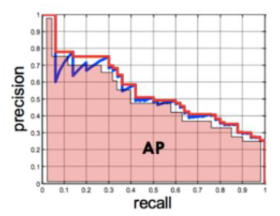
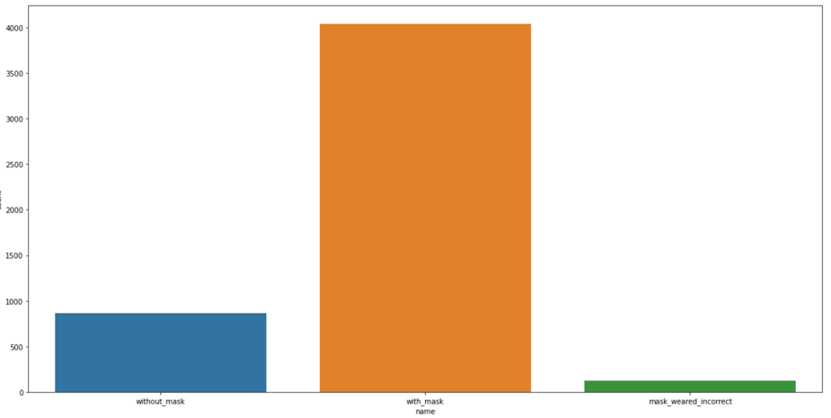
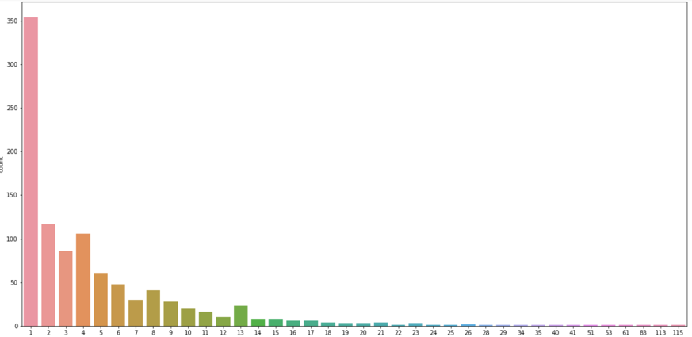

## Mask On Detection Model
Model : [YOLO v5](https://github.com/Limm-jk/yolov5)

### How to Use
```
# install model
> git clone https://github.com/Limm-jk/yolov5.git
> pip install -U -r yolov5/requirements.txt
> cd ./yolov5

# Detection
> python detect.py --weights weights/best.pt --project ./run --save-txt --conf 0.4 --source ./data/images
```

### Performance
```
- best.pt
 P           R           mAP@.5  
 0.626       0.817       0.829 
```

### How to measure performance
**P = Precision**  
Measure how accurate is your predictions.  
i.e. the percentage of your predictions are correct.

**R = Recall**  
Measure how good you find all the positives.  
i.e. the percentage of how much you found the correct answer.

**AP = Average Precision**  


**mAP = mean Average Precision**  
Mean value of AP, in the whole class

### Data

**Class Count**


**Object Count**  

