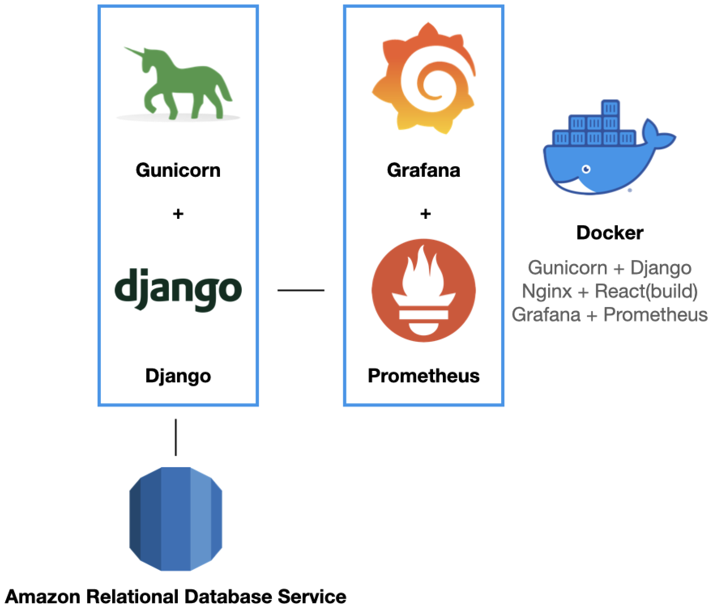
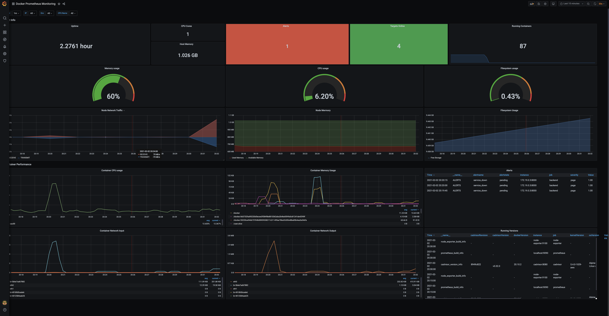
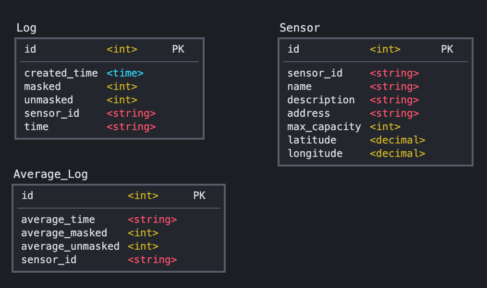

#Back<hr/>

## 1. Architecture<hr/>
Docker, Docker-compose를 통해 개발 환경을 동일하게 구성하였습니다.\
Django + Gunicorn + Amazon RDS로 구성하였습니다.\
Granfa + Prometheus로 Back-end 모니터링을 구현하였습니다.



## 2. Tech Stack<hr/>
|분류|기술|
|-------|------|
|Environment|[Docker](https://www.docker.com/), [Docker-compose](https://docs.docker.com/compose/)|
|Back-end|[Django](https://www.djangoproject.com/), [Gunicorn](https://gunicorn.org/)|
|Monitoring| [Grafana](https://grafana.com/), [Prometheus](https://prometheus.io), [cAdvisor](https://github.com/google/cadvisor), [Alertmanager](https://prometheus.io/docs/alerting/latest/alertmanager/)|
|DataBase|[AWS RDS MySQL](https://aws.amazon.com/ko/rds/)|


## 3. Run with Docker Compose
```
$ git clone https://github.com/Team-Mask-On/Mask_On.git
$ cd back/django
$ docker-compose build
$ docker-compose up
```

# Monitoring<hr/>

## 1. Grafana
[https://localhost:3000]()\
Login\
id: 'admin'\
password:'1234'
### Docker Monitoring Dashboard


### Django application Dashboard


# Database<hr/>
- Amazon RDS MySQL로 DB를 구성하였습니다.
## 1. DB Model<hr/>
Sensor Table : 한 개의 매장에 종속되는 RaspberryPi 하드웨어 테이블\
Log Table: Sensor에서 특정 시간 간격으로 분석한 매장정보에 대한 로그\
Average_Log Table : Log가 들어올 때 마다 자동 생성되는 시간대별 평균 데이터\



## 2. Fake DB 생성 Command <hr/> 
    python manage.py seed_sensor --number
    
    python manage.py seed_log --number
