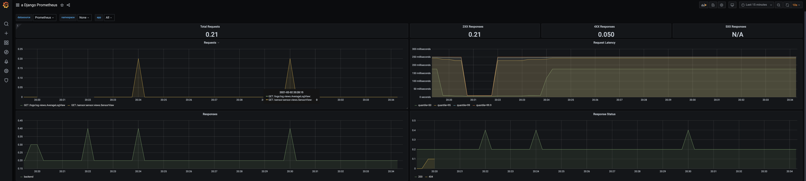
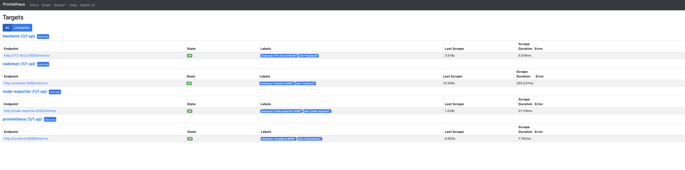
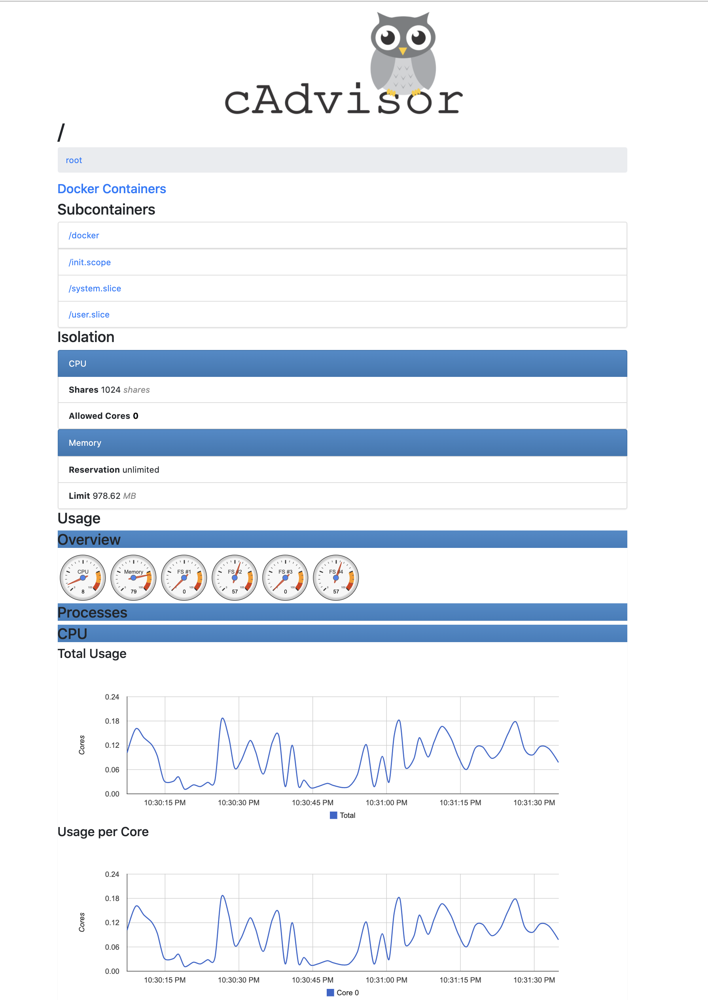
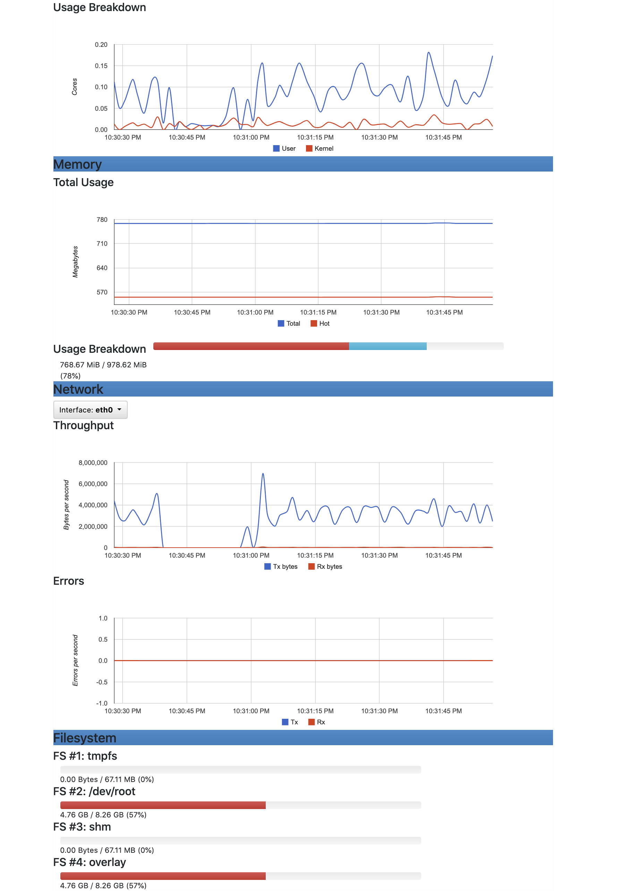
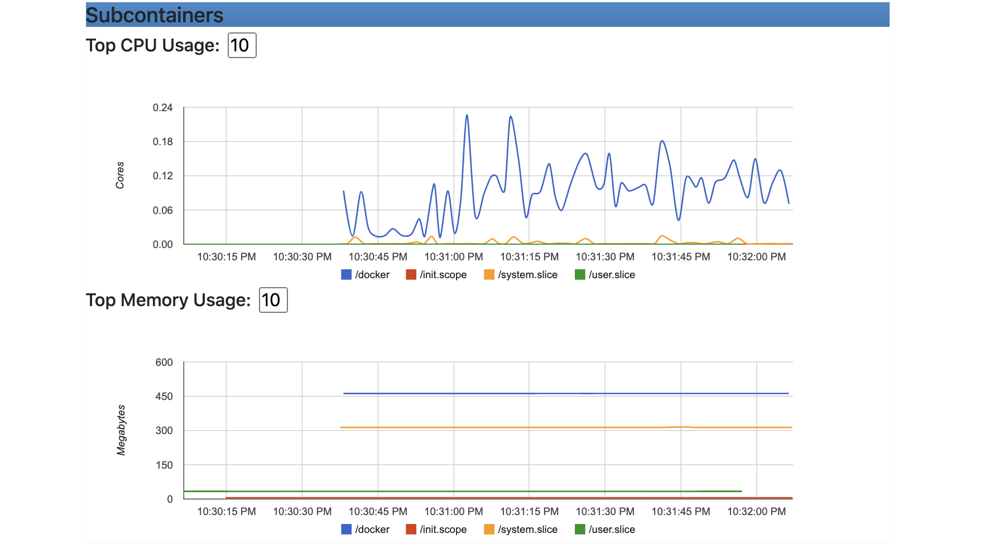
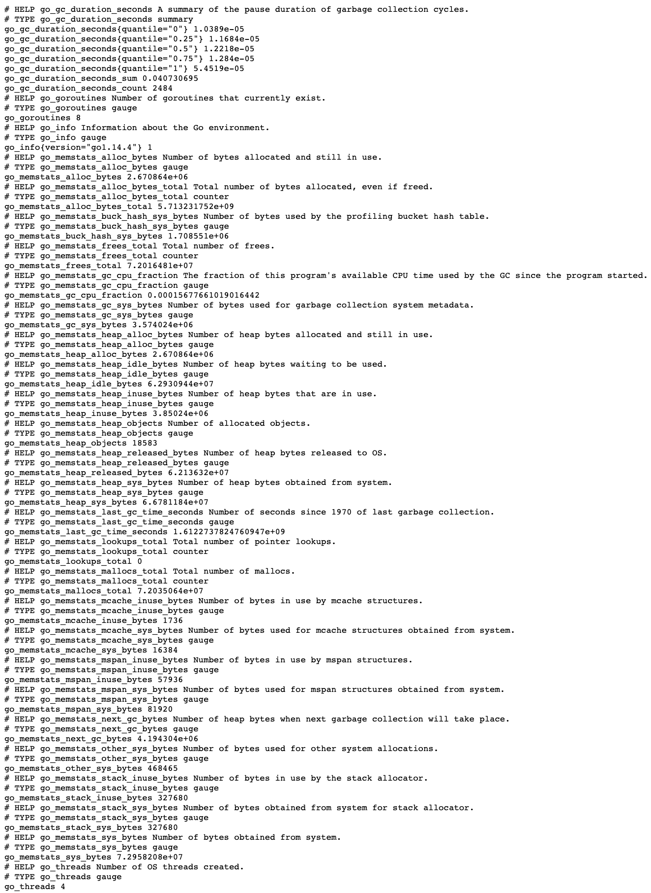
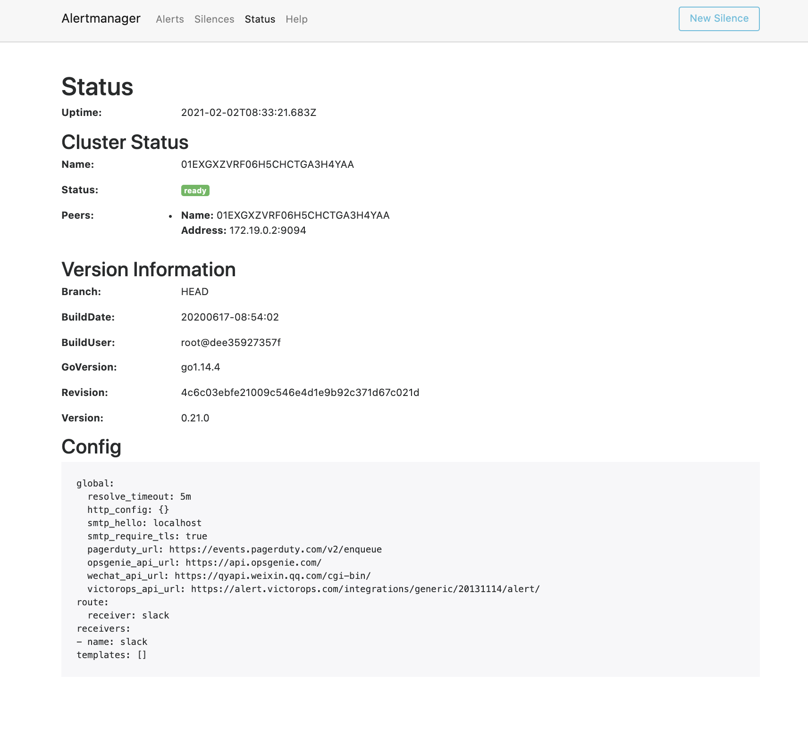

# Back

## 1. Architecture

Docker, Docker-compose를 통해 개발 환경을 동일하게 구성하였습니다.\
Django + Gunicorn + Amazon RDS로 구성하였습니다.\
Granfa + Prometheus로 Back-end 모니터링을 구현하였습니다.

## 2. Tech Stack

|분류|기술|
|-------|------|
|Environment|[Docker](https://www.docker.com/), [Docker-compose](https://docs.docker.com/compose/)|
|Back-end|[Django](https://www.djangoproject.com/), [Gunicorn](https://gunicorn.org/)|
|Monitoring| [Grafana](https://grafana.com/), [Prometheus](https://prometheus.io), [cAdvisor](https://github.com/google/cadvisor), [Alertmanager](https://prometheus.io/docs/alerting/latest/alertmanager/)|
|DataBase|[AWS RDS MySQL](https://aws.amazon.com/ko/rds/)|

# Monitoring

## 1. Introduction
Infrastructure monitoring is the basis for application performance management. 
The underlying system’s availability and health must be maximized continually. 
To achieve this, one has to monitor the system metrics like CPU, memory, network, and disk. Response time lag, if any must be addressed swiftly. 
Here we'll take a look at how to Monitor servers (and even Docker Containers running inside the Server) using 
Grafana, Prometheus, Node Exporter, CAdvisor and django.

## 2. Grafana
[http://mask-on.ml:3000](http://mask-on.ml:3000/) \
Login\
id: 'admin'\
password:'1234'
### Docker Monitoring Dashboard

### Django application Dashboard

## 3. Prometheus
[http://mask-on.ml:9090](http://mask-on.ml:9090/)

## 4. cAdvisor
[http://mask-on.ml:8080](http://mask-on.ml:8080/)

## 5. node-exporter
[http://mask-on.ml:9100](http://mask-on.ml:9100/)

    

## 6. AlertManager
[http://mask-on.ml:9093](http://mask-on.ml:9093/)

# Database

- Amazon RDS MySQL로 DB를 구성하였습니다.
## 1. DB Model

Sensor Table : 한 개의 매장에 종속되는 RaspberryPi 하드웨어 테이블\
Log Table: Sensor에서 특정 시간 간격으로 분석한 매장정보에 대한 로그\
Average_Log Table : Log가 들어올 때 마다 자동 생성되는 시간대별 평균 데이터\

## 2. Fake DB 생성 Command 
 
    python manage.py seed_sensor --number
    
    python manage.py seed_log --number
