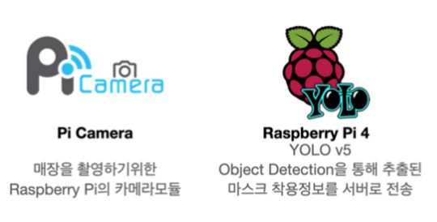

# Mask On Raspberry-pi
라즈베리파이는 YOLOv5가 돌아갈 수 있는 환경 위에서 Mask_On/ai/yolov5의 Model을 활용하여\
매장 내 마스크 착용자 수, 마스크 미착용자 수를 분석합니다.\
전체적인 로직은 아래와 같습니다.
```
1. 특정 시간 간격으로 매장 내의 이미지를 촬영한다.
2. 해당 이미지를 특정 폴더에 저장한다.
3. YOLOv5를 활용하여 저장된 이미지를 분석한다.
4. json 형식으로 나온 결과값을 읽어와 마스크 착용자 수, 마스크 미착용자 수를 얻는다.
5. 자신의 고유 센서 넘버를 계산한다.
6. 현재 시간을 설정해준 시간 값으로 잘라준다(ex) 5분 -> 0900, 0905, ...)
7. 해당 전체 데이터를 웹서버로 송신한다.
```

## Architecture<hr/>
Raspberrypi 4에서 Yolov5를 사용할 수 있는 환경을 구축하였습니다.\
Pi camera와 연동하여 카메라 촬영을 제어할 수 있게 구현하였습니다.



## Tech Stack<hr/>
|분류|기술|
|-------|------|
|OS|[Raspberry pi 64 bit buster](https://www.raspberrypi.org/forums/viewtopic.php?t=275370)|
|Python| Python 3.7|
|YOLOv5| torch 1.7, torchvison 0.8|
|Opencv| Opencv 4.5|


## File Tree<hr/>
```
├── Readme.md: 리드미 파일
├── architecture: 리드미에 들어가는 아키텍처 이미지 리소스
│   └── architecture.png
├── captured_images: 라즈베리파이에서 촬영되는 이미지가 저장되는 폴더
├── get_serial_number.py: 라즈베리파이의 고유 cpu serial 번호를 추출하는 getserial 함수를 가진 파일
├── image_capture.py: 라즈베리파이에서 이미지를 촬영하는 기능인 takePicture 함수를 가진 파일
├── image_detect.py: captured_images에 저장된 이미지를 딥러닝 분석하는 detect 함수를 가진 파일
├── main.py: 부분 기능들을 한데 모아 전체 로직 구성한 파일
├── requirements.txt: 필요한 모듈들을 한데 모아 놓을 파일
├── result_read.py: 이미지 분석 결과값을 읽어와서 계산하는 result_json_read 함수를 가진 파일
├── sender.py: 전체 분석결과 데이터를 웹서버로 송신하는 send_data 함수를 가진 파일
└── time_generator.py: 현재 시간을 기반으로 0900, 0905 등 설정한 minutes 값으로 분류해주는 역할을 하는 파일
```

## Installation<hr/>
**라즈베리파이에 정상적으로 Pi Camera가 연결되었다는 가정하로 진행합니다.**\
**전원이 연결된 라즈베리파이에 네트워크가 연결되었다는 가정하로 진행합니다.**
- 라즈베리파이에 ssh 접속
```
$ ssh pi@"라즈베리파이 IP주소"
password: "라즈베리파이 비밀번호 입력"
```
- Python, pip 버전 확인\
Raspberrypi 64bit os는 기본적으로 3.7 버전이 내장되어있습니다.\
만약 3.7 대의 버전이 안나온다면 따로 설치를 해야합니다.
```
pi@raspberrypi:~ $ python3 -V
Python 3.7.3

pi@raspberrypi:~ $ pip3 --version
pip 18.1 from "" (python 3.7)
```
- 파이썬 3.7 가상환경 설치(위에서 3.7이 노출 안되는 경우)
```
$ sudo apt update 
$ sudo apt install software-properties-common 
$ sudo add-apt-repository ppa:deadsnakes/ppa 
$ sudo apt update 
$ sudo apt install python3.7
$ sudo apt-get install python3.7-venv
$ python3.7 -m venv env

$ ls env
# env가 생성된 것을 확인 가능

$ source env/bin/activate
(env) $
# 가상환경 실행

(env) $ python3 --version
Python 3.7.9
# 정상적으로 3.7 버전으로 노출되는 것 확인 가능

(env) $ pip --version
pip 20.3.3 from "" (python 3.7)
# pip 버전도 3.7 기준인 것을 확인 가능
```
---
### torch, torcvision 설치
- torch, torchvision을 위한 종속성 설치
```
$ sudo apt update 
$ sudo apt upgrade
$ sudo apt install libopenblas-dev libblas-dev m4 cmake cython python3-dev 
python3-yaml python3-setuptools
$ sudo apt-get install libavutil-dev libavcodec-dev libavformat-dev 
libswscale-dev
```
1. [download torch wheel](https://drive.google.com/file/d/1A_u4xEfZtCPtXEo2cLNuMDigDcBd8bmQ/view?usp=sharing)
2. [download torchvision wheel](https://drive.google.com/file/d/1wXWHNTJD8RODMhUkDvNNIBA1x6kLQPuG/view?usp=sharing)
- 위의 wheel을 다운 받아서 라즈베리파이로 옮겨줍니다.
```
$ sudo pip3 install torch-1.7.0a0-cp37-cp37m-linux_aarch64.whl
$ sudo pip3 install torchvision-0.8.0a0+45f960c-cp37-cp37m-linux_aarch64.whl
```

- 이 상태로 `import torch`를 하면 오류가 날 것 입니다. openmpi 설치가 필요합니다.
```
$ sudo apt-get install libopenmpi-dev
$ export LIBRARY_PATH=/usr/lib/aarch64-linux-gnu/openmpi/lib:$LIBRARY_PATH
```

- 정상적으로 설치되었는지 확인
```
# python3 쉘 스크립트 안에서
>>> import torch
>>> torch.__version__
'1.7.0a0+6394982'
>>> import torchvision
>>> torchvision.__version__
'0.8.0a0+45f960c'
```
---
### opencv 설치
- opencv 설치
**Memory Swap을 최소 2047 이상으로 설정하고 진행해야 합니다**
```
$ sudo vi /etc/dphys-swapfile

# /etc/dphys-swapfile
#CONF_SWAPSIZE=100
CONF_SWAPSIZE=2048
# 이와 같은 식으로 SWAPSIZE를 2048 이상으로 적절하게 늘려준다.
# esc + :wq!

$ sudo /etc/init.d/dphys-swapfile restart
[ ok ] Restarting dphys-swapfile (via systemctl): dphys-swapfile.service.
# ok가 나온다면 정상적으로 적용된 것임
```
- [참고 자료: Opencv 설치](https://qengineering.eu/install-opencv-4.5-on-raspberry-64-os.html)
```
$ sudo apt-get update
$ sudo apt-get upgrade
# dependencies
$ sudo apt-get install build-essential cmake git unzip pkg-config
$ sudo apt-get install libjpeg-dev libpng-dev
$ sudo apt-get install libavcodec-dev libavformat-dev libswscale-dev
$ sudo apt-get install libgtk2.0-dev libcanberra-gtk* libgtk-3-dev
$ sudo apt-get install libxvidcore-dev libx264-dev
$ sudo apt-get install python3-dev python3-numpy python3-pip
$ sudo apt-get install libtbb2 libtbb-dev libdc1394-22-dev
$ sudo apt-get install libv4l-dev v4l-utils
$ sudo apt-get install libopenblas-dev libatlas-base-dev libblas-dev
$ sudo apt-get install liblapack-dev gfortran libhdf5-dev
$ sudo apt-get install libprotobuf-dev libgoogle-glog-dev libgflags-dev
$ sudo apt-get install protobuf-compiler

$ wget -O opencv.zip https://github.com/opencv/opencv/archive/4.5.0.zip
$ wget -O opencv_contrib.zip https://github.com/opencv/opencv_contrib/archive/4.5.0.zip

$ unzip opencv.zip
$ unzip opencv_contrib.zip

$ mv opencv-4.5.0 opencv
$ mv opencv_contrib-4.5.0 opencv_contrib
$ cd opencv/
$ mkdir build 
$ cd build #opencv/build

$ cmake -D CMAKE_BUILD_TYPE=RELEASE \
        -D CMAKE_INSTALL_PREFIX=/usr/local \
        -D OPENCV_EXTRA_MODULES_PATH=~/opencv_contrib/modules \
        -D ENABLE_NEON=ON \
        -D WITH_FFMPEG=ON \
        -D WITH_TBB=ON \
        -D BUILD_TBB=ON \
        -D BUILD_TESTS=OFF \
        -D WITH_EIGEN=OFF \
        -D WITH_V4L=ON \
        -D WITH_LIBV4L=ON \
        -D WITH_VTK=OFF \
        -D WITH_QT=OFF \
        -D OPENCV_ENABLE_NONFREE=ON \
        -D INSTALL_C_EXAMPLES=OFF \
        -D INSTALL_PYTHON_EXAMPLES=OFF \
        -D BUILD_NEW_PYTHON_SUPPORT=ON \
        -D BUILD_opencv_python3=TRUE \
        -D OPENCV_GENERATE_PKGCONFIG=ON \
        -D BUILD_EXAMPLES=OFF ..


$ make -j4

$ sudo make install
$ sudo ldconfig
# cleaning (frees 300 KB)
$ make clean
$ sudo apt-get update
```
- 정상적으로 설치되었는지 확인
```
# python3 쉘 스크립트 안에서
>>> import cv2
>>> cv2.__version__
'4.5.0'
```

- v4l2 설치: **라즈베리파이 64bit OS에서는 pi camera, raspistill을 사용 못하기에 해당 모듈을 활용합니다.**
```
$ vcgencmd get_camera
supported=1 detected=1

# 카메라 모듈을 인식하고 있는 것을 확인
```
```
$ sudo modprobe bcm2835-v4l2
$ ls /dev/video0 -l
crw-rw---- 1 root video 81, 7 Jan 22 18:17 /dev/video0
# v4l2로는 정상적으로 동작가능을 확인
```
```
$ sudo nano /etc/modules
# /etc/modules: kernel modules to load at boot time.

bcm2835-v412

# sudo modprobe bcm2835-v4l2를 매번 부팅시마다 해주는 것을 자동화하기 위해 작성
```
---
### requests 설치
**이 과정이 완료되어야 오류 없이 sender.py 실행이 가능합니다**
```
$ pip3 install requests
```
## RUN<hr/>
```
# /Mask_On 최상위 뎁스에서 시작한다는 가정
$ cd rpi # /Mask_On/rpi
$ python3 main.py
촬영 간격을 입력하시오: "원하는 촬영 간격 입력"
```
**입력한 촬영간격에 따라 실제 라즈베리파이 촬영, 현재 시간을 기반으로 시간대 끊어주기 기능이 작동합니다.**\
**ex) 입력: 300 -> 5분 간격으로 촬영하며, 현재 시간을 기반으로 0900, 0905, ... 식으로 저장합니다. 1분 미만은 1분으로 취급합니다.**

## TroubleShooting<hr/>
### torch, torchvision wheel이 설치가 안되는 문제
- torch-1.7.0a0-cp37-cp37m-linux_aarch64.whl is not a supported wheel on this platform 
    * cp37이라는 것은 3.7 버전에서 가능하다는 의미이므로 파이썬 3.7대 위에서 설치함으로써 해결

### torch 설치후 import 안되는 문제 
- OSError: libmpi_cxx.so.40: cannot open shared object file: No such file or directory
    * openmil를 설치해주고 환경 변수 지정을 해줌으로써 해결
    ```
    sudo apt-get install libopenmpi-dev
    export LIBRARY_PATH=/usr/lib/aarch64-linux-gnu/openmpi/lib:$LIBRARY_PATH
    ```
    * [참고 자료](https://forums.developer.nvidia.com/t/pytorch-for-jetson-version-1-7-0-now-available/72048/385)

### 라즈베리파이 os 64bit에서는 MMAL 지원을 안함에따라 raspistill과 picamera가 사용불가능한 문제
- https://www.raspberrypi.org/forums/viewtopic.php?t=213435
- https://www.raspberrypi.org/forums/viewtopic.php?t=285868
    * v4l2를 활용함으로써 해결(아래 링크는 본인의 질문 내역)
    - https://raspberrypi.stackexchange.com/questions/120472/how-can-i-use-camera-in-raspberry-64-bit
    - https://www.facebook.com/groups/codingeverybody/permalink/5254050434635450/

### [Development Log](https://www.notion.so/2021-Silicon-Valley-Online-Internship-4e9d2a51d4e748eeb4302239f7367548)